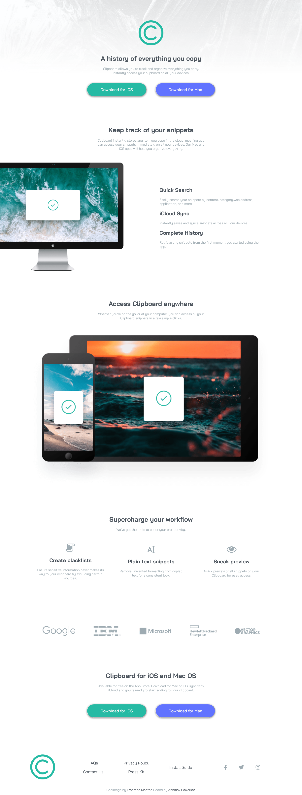

# Frontend Mentor - Clipboard landing page solution

This is a solution to the [Clipboard landing page challenge on Frontend Mentor](https://www.frontendmentor.io/challenges/clipboard-landing-page-5cc9bccd6c4c91111378ecb9). Frontend Mentor challenges help you improve your coding skills by building realistic projects. 

## Table of contents

- [Overview](#overview)
  - [The challenge](#the-challenge)
  - [Screenshot](#screenshot)
- [My process](#my-process)
  - [Built with](#built-with)
  - [What I learned](#what-i-learned)
  - [Continued development](#continued-development)
- [Author](#author)


## Overview

### The challenge

Users should be able to:

- View the optimal layout for the site depending on their device's screen size
- See hover states for all interactive elements on the page

### Screenshot



## My process
-  Structure made with Semantics HTML5 Markup
- Styled with Vanilla CSS.
- For layouts used Flexbox.
- followed a mobile-first approach.
### Built with

- Semantic HTML5 markup
- CSS custom properties
- Flexbox
- CSS Grid
- Mobile-first workflow


### What I learned

```html
<h1>Structuring using HTML5 Semantics like "<main>" and "<section>" </h1>
```
```css
.proud-of-this-css {
  color: papayawhip;
}
```
### Continued development

- Focus is on mastering Advnaced fluid layouts usinfg Flexbox and CSS Grid

- working on mastering CSS Animations and transitions.

## Author

- Frontend Mentor - [@abhinavishere](https://www.frontendmentor.io/profile/abhinavishere)
- Twitter - [@probablyabhinav](https://www.twitter.com/probablyabhinav)

